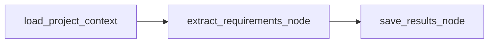
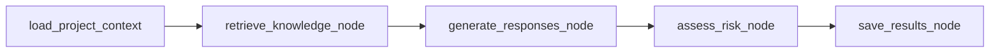

# Agent 工作流说明

## 工作流概览

BidPilot AI 使用 LangGraph 编排 RFP 需求抽取和响应矩阵生成。当前没有人工复核 Agent 节点，人工复核通过响应矩阵 API 和前端编辑完成。

## 需求抽取工作流



入口 API：

- `POST /api/rfp/projects/{project_id}/extract-requirements`

## 响应矩阵工作流



入口 API：

- `POST /api/rfp/projects/{project_id}/generate-responses`

## 节点说明

### load_project_context

职责：

- 加载 `RfpProject`。
- 加载项目下的 RFP 文档。
- 加载已有需求。
- 统计知识库文件数量。
- 拼接 `rfp_text`。

输入：

- `db`
- `project_id`
- `run_type`

输出：

- `project`
- `rfp_documents`
- `rfp_text`
- `requirements`
- `knowledge_file_count`

失败条件：

- 项目不存在。
- 抽取需求时项目没有 RFP 文档。
- 生成响应时项目没有已抽取需求。

### extract_requirements_node

职责：

- 使用 `PromptTemplateService` 加载 `extract_requirements.md`。
- 渲染 `{rfp_text}` 和 `{output_schema}`。
- 通过 `LLMService.invoke_json` 调用模型。
- 使用 `RequirementExtractionResult` 做 Pydantic 校验。

输入：

- `rfp_documents`
- `rfp_text`
- `project`

输出：

- `requirements`
- `extraction_prompt_chars`
- `extraction_schema`

### retrieve_knowledge_node

职责：

- 对每条 `RfpRequirement` 调用统一 `retrieve_knowledge` 服务。
- 由 RetrieverFactory 决定实际使用 simple 或 chroma。
- 把检索结果转换为 Agent state 中的 retrieved contexts。

输入：

- `requirements`
- `top_k`

输出：

- `retrieved_contexts`

输出中的每个 chunk 包含：

- `chunk_id`
- `file_id`
- `content`
- `score`
- `metadata`
- `retriever_type`
- `content_summary`

### generate_responses_node

职责：

- 对每条需求找到对应 retrieved chunks。
- 使用 `PromptTemplateService` 加载 `generate_response.md`。
- 渲染 `{requirement}`、`{retrieved_chunks}` 和 `{output_schema}`。
- 通过 `LLMService.invoke_json` 调用模型。
- 使用 `BidResponseGenerationResult` 做 Pydantic 校验。

输入：

- `requirements`
- `retrieved_contexts`

输出：

- `responses`

### assess_risk_node

职责：

- 基于已生成响应统计 match_status 和 risk_level。
- 不调用 LLM。

输入：

- `responses`

输出：

- `risk_summary.match_status_counts`
- `risk_summary.risk_level_counts`

说明：`backend/app/prompts/assess_risk.md` 是后续扩展模板，当前没有接入新的模型调用。

### save_results_node

职责：

- 当 `run_type=extract_requirements` 时，删除旧需求并保存新需求。
- 当 `run_type=generate_responses` 时，删除旧响应并保存新响应。

输入：

- `run_type`
- `requirements`
- `responses`

输出：

- 保存后的 `requirements` 或原始 `responses`

## AgentRun.steps_json

每次工作流开始前会创建一条 `AgentRun`，初始状态为 `running`。每个节点由 `_instrument_node` 包装，执行完成后同步更新 `AgentRun.steps_json`。

主要结构：

```json
{
  "graph": "bid_agent",
  "run_type": "generate_responses",
  "requirement_count": 8,
  "retrieved_chunk_count": 24,
  "generated_response_count": 8,
  "risk_summary": {"low": 6, "medium": 2, "high": 0},
  "steps": [],
  "langgraph_nodes": [],
  "errors": []
}
```

`langgraph_nodes` 是当前主要观测字段，每个节点记录：

- `node_name`
- `status`
- `input_summary`
- `output_summary`
- `latency_ms`
- `error_message`

响应生成时，`retrieve_knowledge_node.output_summary.retriever_types` 会记录实际检索器类型，例如 `["chroma"]` 或 `["simple"]`。

`steps` 是兼容旧前端展示的旧版步骤数组，当前仍保留。

