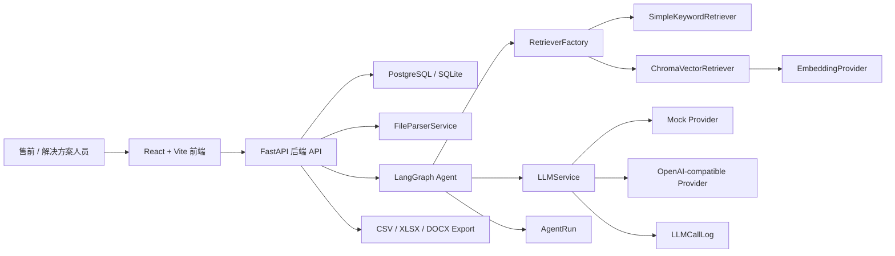
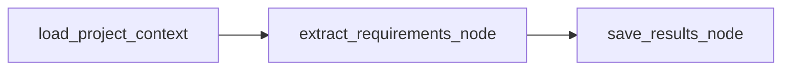
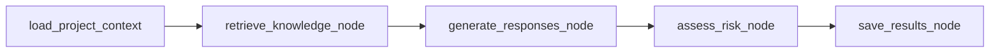

# BidPilot AI 架构说明

## 项目整体架构

BidPilot AI 是一个面向企业招投标响应场景的 RAG + Agent 应用。系统从客户 RFP 文件和企业知识库资料出发，完成需求抽取、知识检索、响应矩阵生成、人工复核、风险统计和交付物导出。

## 前端、后端、数据库、LLM、RAG、Agent 的关系

- 前端负责项目、知识库、响应矩阵、人工复核、导出和日志查看，不直接调用模型或向量库。
- 后端提供统一 API，封装文件解析、数据库访问、Agent 编排、RAG 检索、LLM 调用和交付物导出。
- 数据库保存项目、RFP 文档、抽取需求、知识库文件、知识块、响应矩阵、模型配置和执行日志。
- LLM 调用统一经过 `LLMService`，支持 Mock Provider 和 OpenAI-compatible Provider。
- RAG 检索统一经过 Retriever 抽象，由 `RetrieverFactory` 根据配置选择 simple 或 chroma。
- Agent 使用 LangGraph 组织需求抽取和响应生成流程，并把每个节点的输入摘要、输出摘要、耗时和错误写入 `AgentRun.steps_json`。

## LangGraph 工作流

当前有两个工作流：

需求抽取：

响应矩阵生成：

没有新增人工复核 Agent 节点。人工复核是响应矩阵生成后的 API 编辑流程。

## LLMService 调用链路

1. 业务节点使用 `PromptTemplateService` 渲染 prompt。
2. 节点调用 `LLMService.invoke_json(prompt, output_schema, prompt_type)`。
3. `LLMService` 查询默认启用的 `ModelConfig`。
4. 如果没有可用模型配置且允许 fallback，则使用 `MockLLMProvider`。
5. 如果配置为 `openai-compatible`，则使用加密存储的 API Key、Base URL 和模型名调用兼容 Chat Completions API。
6. 模型返回内容后通过 JSON 提取和 Pydantic Schema 校验。
7. 调用结果写入 `LLMCallLog`，包括 provider、model_name、prompt_type、latency_ms、success 和 error_message。

## RetrieverFactory 检索架构

`RetrieverFactory` 负责根据配置创建实际检索器：

- `RAG_RETRIEVER_TYPE=simple`：创建 `SimpleKeywordRetriever`。
- `RAG_RETRIEVER_TYPE=chroma`：创建 `ChromaVectorRetriever`。
- 配置未知或 Chroma 初始化失败：记录 warning 并 fallback 到 `SimpleKeywordRetriever`。

上传知识库文件后，系统会先保存 `KnowledgeFile` 和 `KnowledgeChunk` 到数据库；如果当前配置为 chroma，再把 chunks 写入 Chroma。Chroma 写入失败不会回滚数据库保存。

## Chroma / Simple Fallback 设计

Chroma 模式提供真正的向量检索能力：

- `MockEmbeddingProvider` 用 deterministic embedding 支撑 Mock 演示和测试。
- `OpenAICompatibleEmbeddingProvider` 已保留接口，可接入真实 embedding 服务。
- Chroma 持久化目录通过 `CHROMA_PERSIST_DIR` 配置。

Simple fallback 的价值：

- 本地或 Docker 环境即使没有 Chroma 可用，也能跑通完整业务演示。
- embedding 配置错误时不影响最小可用流程。
- 测试环境可稳定验证检索抽象和业务链路。

## 可观测性设计

`AgentRun`：

- 记录每次需求抽取或响应矩阵生成。
- 字段包括 project_id、run_type、status、steps_json、error_message、created_at、finished_at。
- `steps_json.langgraph_nodes` 保存节点级输入摘要、输出摘要、耗时、状态和错误。
- 响应生成流程会记录 `retrieve_knowledge_node.output_summary.retriever_types`，可观察 simple/chroma 实际使用情况。

`LLMCallLog`：

- 记录每次 LLM 调用。
- 字段包括 provider、model_name、prompt_type、latency_ms、success、error_message、created_at。
- 不保存完整 prompt 和 API Key，避免泄露敏感信息。

