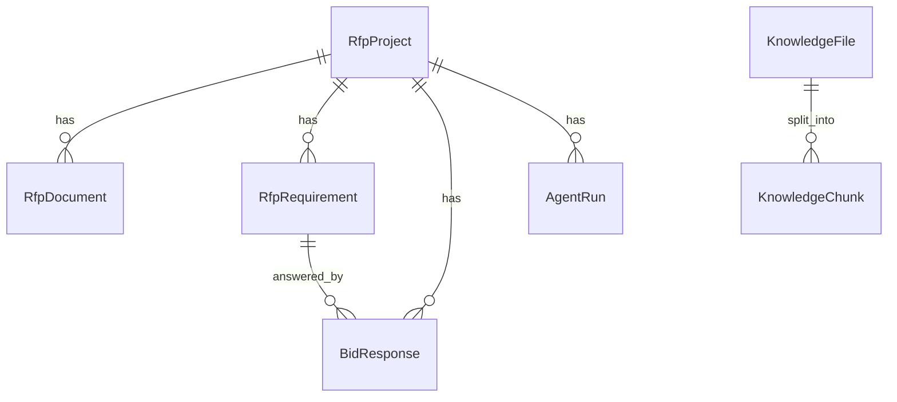

# 数据库设计说明

## 核心数据表

BidPilot AI 使用 SQLAlchemy 建模。生产环境使用 PostgreSQL，开发和测试环境支持 SQLite fallback。

核心表：

- `rfp_projects`
- `rfp_documents`
- `rfp_requirements`
- `knowledge_files`
- `knowledge_chunks`
- `bid_responses`
- `agent_runs`
- `llm_call_logs`
- `model_configs`

## RfpProject

表名：`rfp_projects`

用途：保存一个客户 RFP 响应项目。

关键字段：

- `id`
- `name`
- `customer_name`
- `status`
- `created_at`
- `updated_at`

关系：

- 一个项目有多个 `RfpDocument`。
- 一个项目有多个 `RfpRequirement`。
- 一个项目有多个 `BidResponse`。
- 一个项目有多个 `AgentRun`。

## RfpDocument

表名：`rfp_documents`

用途：保存上传后的 RFP 文件文本内容。

关键字段：

- `id`
- `project_id`
- `filename`
- `content_text`
- `created_at`

说明：文件解析后统一把文本写入 `content_text`，不改变数据库字段来区分 txt/pdf/docx/xlsx。

## RfpRequirement

表名：`rfp_requirements`

用途：保存从 RFP 中抽取出的客户需求。

关键字段：

- `id`
- `project_id`
- `requirement_code`
- `category`
- `content`
- `priority`
- `source_page`
- `created_at`

关系：

- 属于一个 `RfpProject`。
- 可关联多个 `BidResponse`，当前响应矩阵生成时通常每条需求对应一条响应。

## KnowledgeFile

表名：`knowledge_files`

用途：保存企业知识库文件。

关键字段：

- `id`
- `filename`
- `content_text`
- `status`
- `created_at`

说明：上传后由 `FileParserService` 解析为文本，再由 chunking 服务切分。

## KnowledgeChunk

表名：`knowledge_chunks`

用途：保存知识库切分后的文本片段。

关键字段：

- `id`
- `file_id`
- `chunk_index`
- `content`
- `metadata_json`
- `created_at`

关系：

- 属于一个 `KnowledgeFile`。
- 在 simple 模式下从数据库直接检索。
- 在 chroma 模式下同时写入 Chroma，用于向量检索。

## BidResponse

表名：`bid_responses`

用途：保存每条需求的技术响应矩阵结果。

关键字段：

- `id`
- `project_id`
- `requirement_id`
- `match_status`：`satisfied / partial / unsupported`
- `response_text`
- `risk_level`：`low / medium / high`
- `source_chunks_json`
- `human_status`：`pending / confirmed / rejected`
- `human_note`
- `created_at`
- `updated_at`

说明：`human_status` 和 `human_note` 支持人工复核与编辑流程。

## AgentRun

表名：`agent_runs`

用途：保存一次 Agent 工作流执行记录。

关键字段：

- `id`
- `project_id`
- `run_type`：`extract_requirements` 或 `generate_responses`
- `status`
- `steps_json`
- `error_message`
- `created_at`
- `finished_at`

说明：`steps_json` 保存 LangGraph 节点记录、旧版 steps、风险摘要、检索统计和 retriever_type 等信息。

## LLMCallLog

表名：`llm_call_logs`

用途：记录每次模型调用的摘要日志。

关键字段：

- `id`
- `provider`
- `model_name`
- `prompt_type`
- `latency_ms`
- `success`
- `error_message`
- `created_at`

说明：当前不保存完整 prompt 或响应正文，避免泄露敏感内容。

## ModelConfig

表名：`model_configs`

用途：保存模型配置中心数据。

关键字段：

- `id`
- `name`
- `provider`
- `base_url`
- `api_key_encrypted`
- `model_name`
- `temperature`
- `max_tokens`
- `is_default`
- `enabled`
- `created_at`
- `updated_at`

说明：API Key 加密存储，不明文返回前端。

## 表关系

`KnowledgeFile` 和 `KnowledgeChunk` 当前是全局知识库，不直接绑定单个 RFP 项目。后续规划可以增加项目级或租户级知识库隔离。

